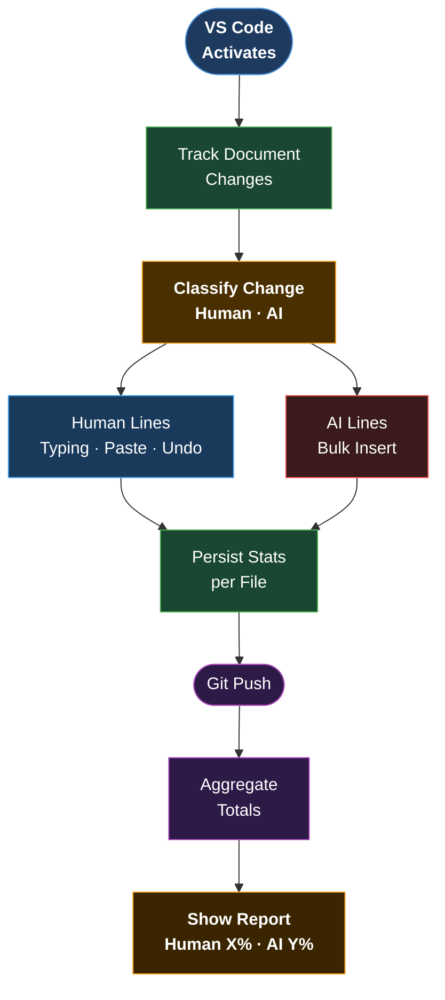

# AI Code Capture

**AI Code Capture** is a VS Code extension designed to automatically track and report the ratio of Human vs. AI-generated code contributions in your project. It listens to document changes in real-time and persists metrics, providing insights into authorship.

## Summary Flow



## Features

### 1. Real-time Contribution Tracking

The extension differentiates between human and AI/automated inputs using a heuristic engine:

- **Human Events**:
  - **Typing**: Single character insertions.
  - **Pasting**: Content matching the current system clipboard.
  - **Undo/Redo**: Explicitly preserved as human actions.
- **AI Events**:
  - **Bulk Insertions**: Large blocks of code inserted rapidly that do _not_ match the clipboard (e.g., Code Completions, Copilot, Agentic AI writes).

### 2. Data Persistence

- Metrics are stored securely in the **Workspace State**, ensuring they persist across VS Code reloads.
- Data is tracked per file.

### 3. Git Integration

- **Automated Reporting**: Listens for `git push` operations.
- **Identity Capture**: Detects the `user.name` from the Git configuration.
- **Feedback**: Displays a summary notification with:
  - User Identity
  - Human Contribution % (and line count)
  - AI Contribution % (and line count)

## Installation

1.  Download the `.vsix` release file.
2.  Open VS Code.
3.  Go to the **Extensions** view (`Ctrl+Shift+X`).
4.  Click the **...** (Views and More Actions) menu at the top of the view.
5.  Select **Install from VSIX...**.
6.  Locate and select the `ai-code-capture-0.0.1.vsix` file.
7.  Reload VS Code if prompted.

## Development Setup

1.  Clone the repository.
2.  Install dependencies:
    ```bash
    npm install
    ```
3.  Open the project in VS Code.

## Development

### Running the Extension

1.  Press `F5` to open a new VS Code window with the extension loaded.
2.  Open any file and start coding.

### Testing

- **Run Tests**: `npm test`
- **Linting**: `npm run lint`

### Pre-commit Hooks

This project uses `pre-commit` to ensure code quality.

1.  Install pre-commit: `pip install pre-commit` (or equivalent).
2.  Install hooks: `pre-commit install`.
3.  Checks run automatically on commit.

## Documentation

- [Activity Diagram — Extension Logic](docs/activity-diagram.md): Full flowchart of how the extension tracks contributions, classifies insertions, and reports on git push.

## Configuration

No manual configuration is required. The extension automatically detects your Git user and tracks all text file changes in the workspace.
