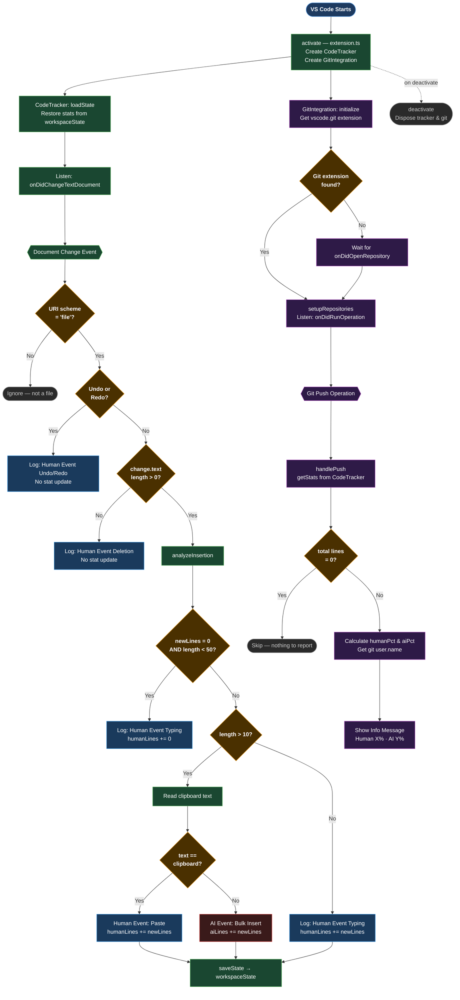

# AI Code Capture — Activity Diagram

# AI Code Capture — Detailed Activity Diagram



## Logic Summary

### Extension Activation (`extension.ts`)
- Creates a `CodeTracker` and `GitIntegration` instance, both registered as disposables.

### CodeTracker (`tracker.ts`)
- **loadState** — restores per-file `{ humanLines, aiLines }` stats from `workspaceState` on startup.
- **onDocumentChange** — fires on every text document change:
  - Skips non-file URIs (output panels, virtual docs).
  - Treats Undo/Redo as human actions (no stat change).
  - Deletions are logged as human events.
  - Insertions are forwarded to `analyzeInsertion`.
- **analyzeInsertion** — classifies inserted text:
  | Condition | Classification |
  |---|---|
  | 0 newlines AND < 50 chars | Human — Typing |
  | ≤ 10 chars | Human — Typing |
  | > 10 chars AND matches clipboard | Human — Paste |
  | > 10 chars AND does NOT match clipboard | **AI — Bulk Insert** |
- Persists updated stats to `workspaceState` after each insertion.

### GitIntegration (`git.ts`)
- Hooks into the built-in `vscode.git` extension.
- Listens for `Push` operations on every repository.
- On push, aggregates totals across all tracked files and shows an information message:
  > `Code Capture: Pushed by <user>. Human: X% (N lines), AI: Y% (M lines)`
```
